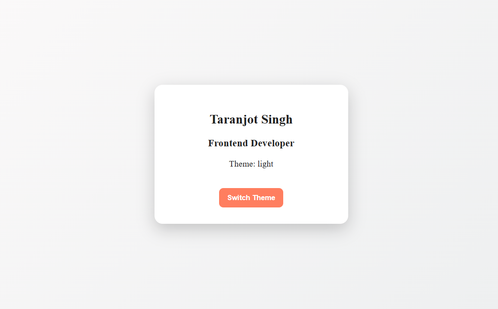
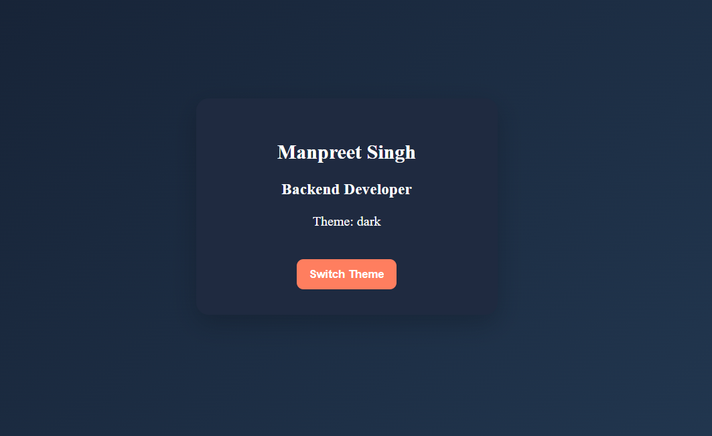
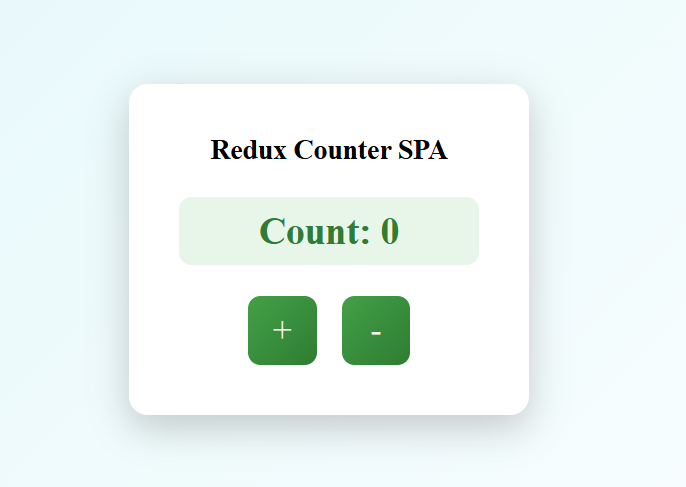
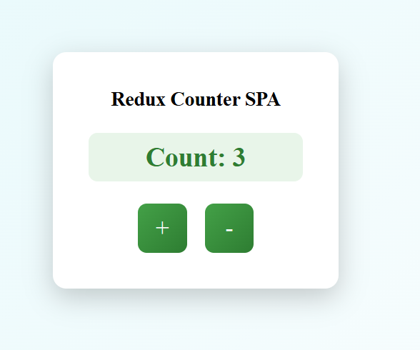

# Experiment 4 – State Management (React Context API & Redux)

## Experiment 4.1: React Context API

### Aim
To implement global state management using Context API.

### Technologies
- React
- Context API
- CSS

### Features
- Global user data
- Theme switching (Light / Dark)

### Screenshots

Light Theme:

Dark Theme:

--------------------------------------------

## Experiment 4.2: Redux Counter

### Aim
To implement centralized state management using Redux.

### Technologies
- React
- Redux Toolkit
- CSS

### Features
- Increment / Decrement counter
- Centralized state

### Screenshots

Initial State:

Updated State:

